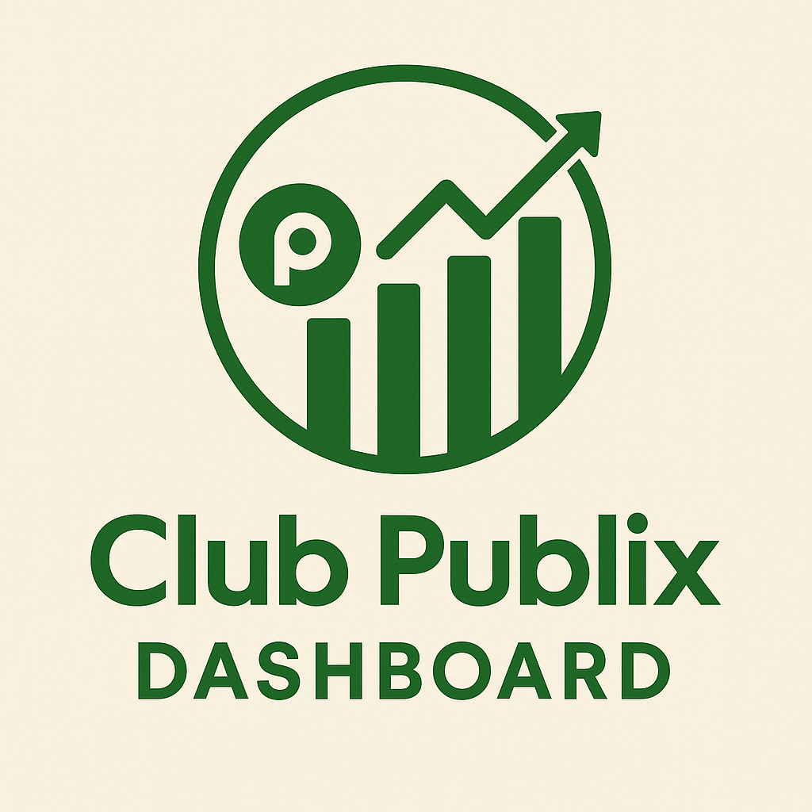
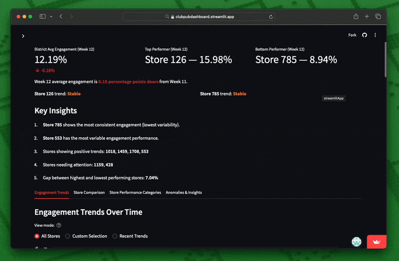

<h1 align="center">
  <br>
  <a href="#"></a>
  <br>
  Club Publix Engagement Dashboard
  <br>
</h1>

<h4 align="center">A personal project for monitoring and analyzing Club Publix engagement across stores — built by a Publix Assistant Customer Service Manager for real-world use by managers at every level.</h4>

<p align="center">
  <a href="#-project-overview">Project Overview</a> •
  <a href="#-key-features">Key Features</a> •
  <a href="#-how-to-use">How To Use</a> •
  <a href="#-tech-stack">Tech Stack</a> •
  <a href="#-credits">Credits</a> •
  <a href="#-disclaimer">Disclaimer</a>
</p>

<p align="center">
  
</p>

---

## 📋 Project Overview

This dashboard was developed as a personal side project to help visualize and track **Club Publix engagement** performance across Publix stores. It's designed for practical use at any level of store management—from **District Managers** seeking a high-level view to **Customer Service Managers** and **ACSMs** monitoring weekly performance.

> 💡 **Note:** This dashboard is not an official Publix product. It is a personal project, built independently using data I manually compile from weekly performance emails sent to stores.

Each Monday, stores receive an email with engagement stats including:
- **Engaged Transaction %** (percentage of transactions tied to a Club Publix member)
- **Store Rank** within the district
- **Quarter-to-Date %**

I extract that information manually and enter it into a spreadsheet, which is then used to power the dashboard.

---

## 🔍 Key Features

- **Custom Data Input:**  
  Accepts manually created CSV/XLSX files—no standardized data feed required.

- **Engagement Trends Over Time:**  
  Visualizes engagement by store, week, and district average with optional moving average smoothing.

- **Store Performance Categories:**  
  Automatically categorizes stores based on current performance and engagement trajectory.

- **Heatmaps & Comparisons:**  
  Identify top and bottom performers using visual heatmaps and bar charts.

- **Anomaly Detection:**  
  Flags significant week-over-week engagement spikes or drops using Z-score analysis.

- **Designed for All Levels of Leadership:**  
  District Managers, Store Managers, Customer Service Managers, and ACSMs can all use it to gain insight into their area's performance.

---

## 🚀 How To Use

### 1. **Prepare Your Data**
   Create a CSV or Excel file containing your weekly Club Publix engagement data with these required columns:
   - `Store #` - Store identifier
   - `Week` or `Date` - The period the data represents
   - `Engaged Transaction %` - Percentage of transactions tied to Club Publix members
   
   Recommended additional columns:
   - `Weekly Rank` - Store's rank within the district
   - `Quarter to Date %` - Cumulative engagement for the quarter

   > 💡 **Note:** This dashboard works with manually compiled data from weekly engagement emails. You'll need to extract the numbers from those emails and create your own CSV/Excel file.

### 2. **Access the Dashboard**
   
   **Option A: Use the Online Version (Recommended)**
   - Access the dashboard directly at [Streamlit Community Cloud](https://club-publix-dashboard.streamlit.app)
   - No installation required - just open the link in your browser
   
   **Option B: Run Locally (For Advanced Users)**
   ```bash
   # Clone repository and install requirements
   git clone https://github.com/yourusername/club-publix-dashboard.git
   cd club-publix-dashboard
   pip install -r requirements.txt
   
   # Launch locally
   streamlit run dashboard.py
   ```

### 3. **Upload Your Data**
   - Use the sidebar uploader to import your CSV/Excel file
   - Optionally upload a second file for period comparison

### 4. **Explore the Dashboard**
   Navigate through the tabs to access different insights:
   
   **Engagement Trends Tab**
   - View engagement over time with optional moving averages
   - Analyze weekly performance using the heatmap visualization
   - Identify improving or declining stores through recent trend analysis
   
   **Store Comparison Tab**
   - Compare current performance across all stores
   - See relative performance against district average
   - Track weekly rank changes if this data is available
   
   **Store Performance Categories Tab**
   - View automatically classified store categories based on performance
   - Get specific action plans tailored to each store's situation
   - Find recommended learning partners for underperforming stores
   
   **Anomalies & Insights Tab**
   - Discover significant week-over-week changes (anomalies)
   - Review store-specific recommendations
   - Find improvement opportunities for each location

### 5. **Use Filters and Settings**
   - Apply quarter and week filters in the sidebar
   - Select specific stores for focused analysis
   - Adjust analysis parameters in Advanced Settings

> 💡 **Tip:** For privacy and security, all data processing happens in your browser. Your data is not stored on Streamlit's servers when using the online version.

---

## 🛠 Tech Stack

Built using:

- [Streamlit](https://streamlit.io/) – dashboard framework
- [Pandas](https://pandas.pydata.org/) – data manipulation
- [NumPy](https://numpy.org/) – numerical processing
- [Altair](https://altair-viz.github.io/) – interactive charts

---

## 🙌 Credits

This dashboard was developed by Reid M. as a self-initiated tool to assist in performance tracking at the store and district level.

If you're in retail operations or corporate and want to discuss this project—or how similar tools could support your work—feel free to reach out.

📩 [My LinkedIn](https://www.linkedin.com/in/reidmillman/)

---

## 🛡️ Disclaimer

This project is **not affiliated with or endorsed by Publix Super Markets, Inc.**

The dashboard itself contains **no embedded data** from Publix systems or communications. It is a standalone tool designed to work with **manually created data files** based on weekly store-level engagement emails.

All data used in the dashboard is input manually by the user, and the dashboard performs all processing locally. **No customer data, employee records, internal systems, or confidential information are stored or shared.**

This project was built independently as a **personal productivity and visualization tool**, and as a demonstration of technical ability.

---
